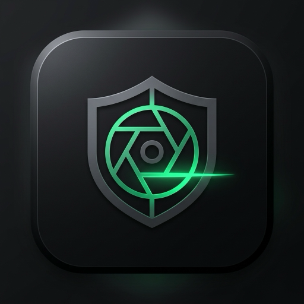

# FreeAntidetect (Root Detect)

<p align="center">
  
  <br>
  <b>Автономный локальный антидетект-браузер с Web Dashboard и CLI интерфейсом</b>
  <br>
  <i>Бесплатно, без подписок, без облачных баз данных и ограничений по профилям</i>
</p>

<p align="center">
  <a href="https://github.com/nadaroot/freeantidetect/releases/latest"></a>
  <a href="https://github.com/nadaroot/freeantidetect/releases"></a>
  <a href="./LICENSE"></a>
  
  
</p>

---

## Скачать готовые сборки (Releases)

Готовые автономные исполняемые файлы без необходимости установки Python:

[Перейти ко всем релизам (GitHub Releases)](https://github.com/nadaroot/freeantidetect/releases)

| Платформа | Рекомендуемая версия (Web Dashboard) | Консольная версия (CLI / TUI) |
| :--- | :--- | :--- |
| **Windows** (x64) | [**RootDetect-Web.exe**](https://github.com/nadaroot/freeantidetect/releases/latest/download/RootDetect-Web.exe) | [**RootDetect-CLI.exe**](https://github.com/nadaroot/freeantidetect/releases/latest/download/RootDetect-CLI.exe) |
| **macOS** (Apple Silicon M1-M4) | [**RootDetect-Web-macos-arm64.zip**](https://github.com/nadaroot/freeantidetect/releases/latest/download/RootDetect-Web-macos-arm64.zip) | [**RootDetect-CLI-macos-arm64.zip**](https://github.com/nadaroot/freeantidetect/releases/latest/download/RootDetect-CLI-macos-arm64.zip) |
| **macOS** (Intel x86_64) | [**RootDetect-Web-macos-x64.zip**](https://github.com/nadaroot/freeantidetect/releases/latest/download/RootDetect-Web-macos-x64.zip) | [**RootDetect-CLI-macos-x64.zip**](https://github.com/nadaroot/freeantidetect/releases/latest/download/RootDetect-CLI-macos-x64.zip) |
| **Linux** (x86_64) | [**RootDetect-Web-linux-x64.tar.gz**](https://github.com/nadaroot/freeantidetect/releases/latest/download/RootDetect-Web-linux-x64.tar.gz) | [**RootDetect-CLI-linux-x64.tar.gz**](https://github.com/nadaroot/freeantidetect/releases/latest/download/RootDetect-CLI-linux-x64.tar.gz) |

---

## Возможности

* **Два режима интерфейса**:
  * **Web Dashboard**: Локальный веб-интерфейс (`http://127.0.0.1:5050`) для управления, настройки и запуска профилей.
  * **Interactive TUI**: Консольное меню для работы через SSH или терминал.
* **Два браузерных движка (Chromium и Gecko)**:
  * Поддержка **Google Chrome, Brave, Ungoogled Chromium, Thorium, Mozilla Firefox, LibreWolf**.
  * Автоматический поиск установленных в системе браузеров (Windows, macOS, Linux).
* **Встроенный загрузчик чистых portable браузеров**:
  * Загрузка и распаковка официальных изолированных сборок (Google Chrome for Testing, Ungoogled, Brave, Thorium, Firefox, LibreWolf).
  * Отключение телеметрии, уведомлений о тестировании и всплывающих окон восстановления сессий.
* **Эмуляция ОС и мобильных устройств**:
  * **Windows**: 11, 10, 8.1, 7.
  * **macOS**: 15 (Sequoia), 14 (Sonoma), 13 (Ventura).
  * **iOS**: iPhone 16 Pro, iPhone 15 Pro Max, iPad Pro 12.9 (Touch эмуляция `maxTouchPoints = 5`, Retina DPR, Apple GPU).
  * **Android**: Samsung Galaxy S24 Ultra, Google Pixel 8 Pro, Xiaomi 14 Pro (Snapdragon 8 Gen 3, Adreno 750 / Mali G715, Touch).
  * **Linux**: Ubuntu / Debian Desktop.
* **Маскировка фингерпринтов (Stealth Engine)**:
  * Скрытие автоматизации (`navigator.webdriver = false`).
  * Спуфинг видеокарт WebGL (Apple Silicon M-серии, NVIDIA RTX 4080/4090, AMD Radeon, Intel Iris, Adreno, Mali).
  * Детерминированный Canvas и AudioContext шум под каждый профиль.
  * Настройка ядер CPU (`hardwareConcurrency`), RAM (`deviceMemory`), разрешения экрана, User-Agent, языков и геолокации.
  * Защита от WebRTC IP Leak.
* **Поддержка прокси**:
  * HTTP, HTTPS, SOCKS4, SOCKS5 с авторизацией (`user:pass`).
  * Встроенная проверка доступности, внешнего IP, страны и задержки (пинг).
* **100% Автономность**:
  * Профили сохраняются локально.
  * Без внешних облачных серверов, телеметрии и подписок.

---

## Запуск из исходного кода (Python)

### 1. Клонирование репозитория
```bash
git clone https://github.com/nadaroot/freeantidetect.git
cd freeantidetect
```

### 2. Установка зависимостей
```bash
pip install -r requirements.txt
```

### 3. Запуск веб-интерфейса (Web Dashboard)
```bash
python3 web_app.py
```
> Панель управления доступна по адресу: **`http://127.0.0.1:5050`**

### 4. Запуск консольного интерфейса (CLI)
```bash
python3 antidetect.py
```

---

## Сборка в один исполняемый файл

Для самостоятельной сборки бинарных файлов используется `build_standalone.py`:

```bash
# Собрать веб-версию (RootDetect-Web)
python3 build_standalone.py --target web

# Собрать консольную версию (RootDetect-CLI)
python3 build_standalone.py --target cli

# Собрать все версии
python3 build_standalone.py --target all
```
Скомпилированные файлы сохраняются в папке `dist/`.

---

## Лицензия

Проект распространяется под свободной лицензией [MIT](./LICENSE).
